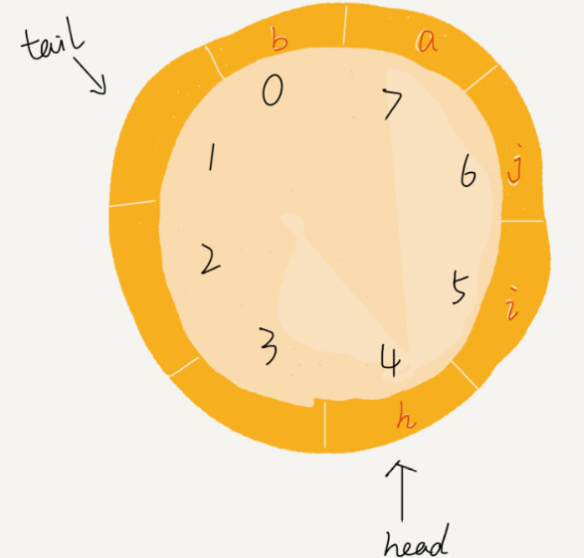

https://leetcode-cn.com/problems/group-anagrams/

## 1 题目内容

给定一个字符串数组，将字母异位词组合在一起。字母异位词指字母相同，但排列不同的字符串。

示例:

```
输入: ["eat", "tea", "tan", "ate", "nat", "bat"],
输出:
[
  ["ate","eat","tea"],
  ["nat","tan"],
  ["bat"]
]
```


说明：

- 所有输入均为小写字母。
- 不考虑答案输出的顺序。


## 2 我的思考与实现

预习看了王争老师的文章，脑海有下图这么个数据结构，然后在纸上画出来，照着模型，就可以写出来。

但第一次还真不好一下写对，插入和删除数据，要仔细考虑底层存储数组遇到数组头或者尾，头尾指针的正确移动。提交错了两次，调试后才调整过来。





### 方法1

```java
package myself;

class MyCircularDeque {

    int[] arr;
    int header = 0;
    int tail = 0;
    int capacity; //队列容量
    int size = 0; //队列当前填了几个元素

    /**
     * Initialize your data structure here. Set the size of the deque to be k.
     */
    public MyCircularDeque(int k) {
        arr = new int[k];
        capacity = k;
    }

    /**
     * Adds an item at the front of Deque. Return true if the operation is successful.
     */
    public boolean insertFront(int value) {
        if (isFull()) return false;
        if (!isEmpty()) {
            header = (header + 1) % capacity;
        }
        arr[header] = value;
        size++;
        return true;
    }

    /**
     * Adds an item at the rear of Deque. Return true if the operation is successful.
     */
    public boolean insertLast(int value) {
        if (isFull()) return false;
        if (!isEmpty()) {
            if (tail == 0) {
                tail = capacity - 1;
            } else {
                tail--;
            }
        }
        arr[tail] = value;
        size++;
        return true;
    }

    /**
     * Deletes an item from the front of Deque. Return true if the operation is successful.
     */
    public boolean deleteFront() {
        if (isEmpty()) return false;
        if (size > 1) {
            if (header == 0) {
                header = capacity - 1;
            } else {
                header--;
            }
        }
        size--;
        return true;
    }

    /**
     * Deletes an item from the rear of Deque. Return true if the operation is successful.
     */
    public boolean deleteLast() {
        if (isEmpty()) return false;
        if (size > 1) {
            tail = (tail + 1) % capacity;
        }
        size--;
        return true;
    }

    /**
     * Get the front item from the deque.
     */
    public int getFront() {
        if (isEmpty()) return -1;
        return arr[header];
    }

    /**
     * Get the last item from the deque.
     */
    public int getRear() {
        if (isEmpty()) return -1;
        return arr[tail];
    }

    /**
     * Checks whether the circular deque is empty or not.
     */
    public boolean isEmpty() {
        return size == 0;
    }

    /**
     * Checks whether the circular deque is full or not.
     */
    public boolean isFull() {
        return size == capacity;
    }
}
```

#### 复杂度

- 时间复杂度: $ O(1) $ 

  > 所有操作都是O(1)

- 空间复杂度: $ O(1)  $


## 3 其他人解答

https://leetcode-cn.com/problems/design-circular-deque/solution/shu-zu-shi-xian-de-xun-huan-shuang-duan-dui-lie-by/


```java
public class MyCircularDeque {

    // 1、不用设计成动态数组，使用静态数组即可
    // 2、设计 head 和 tail 指针变量
    // 3、head == tail 成立的时候表示队列为空
    // 4、tail + 1 == head

    private int capacity;
    private int[] arr;
    private int front;
    private int rear;

    /**
     * Initialize your data structure here. Set the size of the deque to be k.
     */
    public MyCircularDeque(int k) {
        capacity = k + 1;
        arr = new int[capacity];

        // 头部指向第 1 个存放元素的位置
        // 插入时，先减，再赋值
        // 删除时，索引 +1（注意取模）
        front = 0;
        // 尾部指向下一个插入元素的位置
        // 插入时，先赋值，再加
        // 删除时，索引 -1（注意取模）
        rear = 0;
    }

    /**
     * Adds an item at the front of Deque. Return true if the operation is successful.
     */
    public boolean insertFront(int value) {
        if (isFull()) {
            return false;
        }
        front = (front - 1 + capacity) % capacity;
        arr[front] = value;
        return true;
    }

    /**
     * Adds an item at the rear of Deque. Return true if the operation is successful.
     */
    public boolean insertLast(int value) {
        if (isFull()) {
            return false;
        }
        arr[rear] = value;
        rear = (rear + 1) % capacity;
        return true;
    }

    /**
     * Deletes an item from the front of Deque. Return true if the operation is successful.
     */
    public boolean deleteFront() {
        if (isEmpty()) {
            return false;
        }
        // front 被设计在数组的开头，所以是 +1
        front = (front + 1) % capacity;
        return true;
    }

    /**
     * Deletes an item from the rear of Deque. Return true if the operation is successful.
     */
    public boolean deleteLast() {
        if (isEmpty()) {
            return false;
        }
        // rear 被设计在数组的末尾，所以是 -1
        rear = (rear - 1 + capacity) % capacity;
        return true;
    }

    /**
     * Get the front item from the deque.
     */
    public int getFront() {
        if (isEmpty()) {
            return -1;
        }
        return arr[front];
    }

    /**
     * Get the last item from the deque.
     */
    public int getRear() {
        if (isEmpty()) {
            return -1;
        }
        // 当 rear 为 0 时防止数组越界
        return arr[(rear - 1 + capacity) % capacity];
    }

    /**
     * Checks whether the circular deque is empty or not.
     */
    public boolean isEmpty() {
        return front == rear;
    }

    /**
     * Checks whether the circular deque is full or not.
     */
    public boolean isFull() {
        // 注意：这个设计是非常经典的做法
        return (rear + 1) % capacity == front;
    }
}
```

我的点评

> 他的做法，跟我的，还是有些不同的。
>
> 他的做法有一个较巧的点，就是他new出来的底层的数组大小是k+1. 这个操作是为了方便配合他后续的一些操作。
>
> 判空跟判满的时候，他直接使用头尾指针的位置来做判断。其实，我一开始做的时候也想过直接使用头尾指针来操作判空，判满。但是我发现，引入一个size变量，会使思考和操作简单点。
>
> 试想一下，如果他如果一开始new出来的数组size 是k。它就没法做到直接用return (rear + 1) % capacity == front;来判满。如果数组size是k，空跟满的时候，头和尾指针在同一位置，是没法区分的。所以，我才引入size变量。 也就是，他的一系列操作前提是new出来的底层的数组大小是k+1. 当然，这也是一个很好的思路。


