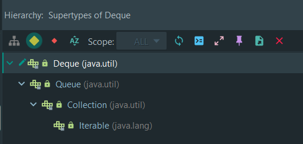
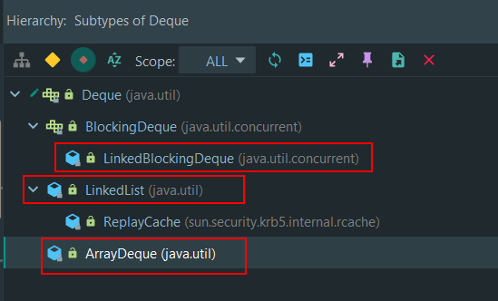

# Deque 双端队列

## 1 作业题

作业题是，用addFirst或者addLast方法改写课程上的deque的api使用的小demo。

直接去看一下jdk里面的源码注释，就可以知道push，addFirst，addLast什么情况了。


```java
    /**
     * Pushes an element onto the stack represented by this deque (in other
     * words, at the head of this deque) if it is possible to do so
     * immediately without violating capacity restrictions, returning
     * <tt>true</tt> upon success and throwing an
     * <tt>IllegalStateException</tt> if no space is currently available.
     *
     * <p>This method is equivalent to {@link #addFirst}.
     *
     * @throws IllegalArgumentException if some property of the specified
     *         element prevents it from being added to this deque
     */
    void push(E e);
```


> This method is equivalent to {@link #addFirst}.  

**jdk自己也说了，deque的push方法等同于addFirst**。所以作业题，直接将push改为addFirst就可以了。

而addLast是在队列末尾加元素，所以将插入元素的顺序倒一下就可以了。


```java
    /**
     * Inserts the specified element at the front of this deque if it is
     * possible to do so immediately without violating capacity restrictions.
     * When using a capacity-restricted deque, it is generally preferable to
     * use method {@link #offerFirst}.
     *
     * @param e the element to add
     * @throws IllegalArgumentException if some property of the specified
     *         element prevents it from being added to this deque
     */
    void addFirst(E e);
```


```java
    /**
     * Inserts the specified element at the front of this deque unless it would
     * violate capacity restrictions.  When using a capacity-restricted deque,
     * this method is generally preferable to the {@link #addFirst} method,
     * which can fail to insert an element only by throwing an exception.
     *
     * @param e the element to add
     * @return <tt>true</tt> if the element was added to this deque, else
     *         <tt>false</tt>
     */
    boolean offerFirst(E e);
```


> When using a capacity-restricted deque, it is generally preferable to use method {@link #offerFirst}.

另外，从上面的注释文档来看。**jdk自己说了，如果是使用一个容量大小有限的deque。一般更为建议使用offerFirst方法。** 因为addFirst插不进去的时候会抛异常，而offerFirst不会，它只会返回一个布尔值表示是否成功。


## 2 关于Deque

### 2.1 概述

Deque是jdk1.6后才有的一个接口，注意，Deque是接口。 **它是一个线性集合型的数据结构，支持两端插入删除数据。**它是'double ended queue'的缩写，然后发音读作deck ( 这些都是jdk文档里面写的)

```
* A linear collection that supports element insertion and removal at
* both ends.  The name <i>deque</i> is short for "double ended queue"
* and is usually pronounced "deck".  Most <tt>Deque</tt>
* implementations place no fixed limits on the number of elements
* they may contain, but this interface supports capacity-restricted
* deques as well as those with no fixed size limit.
```


### 2.2 与Stack的关系

```
 * <p>Deques can also be used as LIFO (Last-In-First-Out) stacks.  This
 * interface should be used in preference to the legacy {@link Stack} class.
 * When a deque is used as a stack, elements are pushed and popped from the
 * beginning of the deque.  Stack methods are precisely equivalent to
 * <tt>Deque</tt> methods as indicated in the table below:
 *
 * <p>
 * <table BORDER CELLPADDING=3 CELLSPACING=1>
 *  <tr>
 *    <td ALIGN=CENTER> <b>Stack Method</b></td>
 *    <td ALIGN=CENTER> <b>Equivalent <tt>Deque</tt> Method</b></td>
 *  </tr>
 *  <tr>
 *    <td>{@link #push push(e)}</td>
 *    <td>{@link #addFirst addFirst(e)}</td>
 *  </tr>
 *  <tr>
 *    <td>{@link #pop pop()}</td>
 *    <td>{@link #removeFirst removeFirst()}</td>
 *  </tr>
 *  <tr>
 *    <td>{@link #peek peek()}</td>
 *    <td>{@link #peekFirst peekFirst()}</td>
 *  </tr>
 * </table>
```


> **Deques can also be used as LIFO (Last-In-First-Out) stacks.**


**Deque可以直接当成栈Stack来使用(jdk中Stack这个类是jdk1.0就有了)**。所以，Deque有一套，stack型的api，也就是push，pop，peek方法。

但是从代码上来讲，jdk 1.6.0 里面，Deque和Stack，基本没有半毛钱关系。具体看下面的，Deque的继承层次与实现。


### 2.3 Deque的继承层次与实现





Deque继承了Queue接口，而Queue继承了Collection接口。所以，Deque是一个集合.（当然这很废话！不过，现在是从jdk的设计思想和代码实现层面上去理解的）。它也能对外提供一个Collection的功能（职责）。





从整个jdk1.6.0 的代码实现来看，**jdk里面Deque的具体实现，就只有三个。**其中，我们常用的LinkedList是其中的一个实现。

所以，Deque能当Stack用。不过从jdk1.6.0的代码层面上讲，Deque这个接口和Stack这个类，没有太多的关系。

