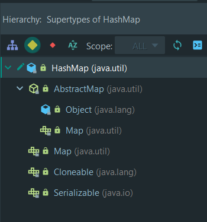
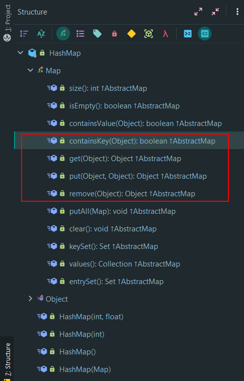

# HashMap的jdk1.2.0源码分析

## 前言

为什么会选择jdk1.2.0来做分析？HashMap是jdk1.2.0的时候推出来的。所以这一版的代码是最简洁的，也最能体会设计思想的。 至于jdk1.8后，HashMap内部实现有一个大改版，但这次时间不够了，再另外再做一个总结了。等后面学了红黑树，一同补上。


## 1 HashMap的继承层次与API


### 1.1 继承层次




HashMap的继承层次非常简单。其实就是实现了Map接口的功能，**也就是它就只具有一个Map的功能而已**。


### 1.2 API




HashMap的对外提供的方法不多，除了自己的4个构造方法，就是对map的实现了。下面讲一下，它最主要的4个方法。


## 2 HashMap的底层结构与逻辑结构


```java
/**
     * The hash table data.
     */
private transient Entry table[];
```


HashMap开篇就声明了一个Entry类型的数组，并命名为table.


```java
/**
     * HashMap collision list entry.
     */
    private static class Entry implements Map.Entry {
	int hash;
	Object key;
	Object value;
	Entry next;
        //... ...
    }
```


而Entry，可以很容易的看到，它就是一个链表的结构，而且是一个单链表。每个节点除了存next指针，还存有3个数据，hash值，key还有value。


**所以说，jdk1.2.0的HashMap解决冲突，用的就是链表法。**


## 3 HashMap的主要逻辑分析


### 3.1 put

```java
public Object put(Object key, Object value) {
    // Makes sure the key is not already in the HashMap.
    Entry tab[] = table;
    int hash = 0;
    int index = 0;

    if (key != null) {
        hash = key.hashCode();
        index = (hash & 0x7FFFFFFF) % tab.length;
        for (Entry e = tab[index] ; e != null ; e = e.next) {
            if ((e.hash == hash) && key.equals(e.key)) {
                Object old = e.value;
                e.value = value;
                return old;
            }
        }
    } else {
        for (Entry e = tab[0] ; e != null ; e = e.next) {
            if (e.key == null) {
                Object old = e.value;
                e.value = value;
                return old;
            }
        }
    }

    modCount++;
    if (count >= threshold) {
        // Rehash the table if the threshold is exceeded
        rehash();

        tab = table;
        index = (hash & 0x7FFFFFFF) % tab.length;
    }

    // Creates the new entry.
    Entry e = new Entry(hash, key, value, tab[index]);
    tab[index] = e;
    count++;
    return null;
}
```


从这段源码中，可以分析出HashMap的插入过程：

#### KEY为null

当一个数据要插入的时候，先分析，key是否为null。如果为null，看下面

```java
for (Entry e = tab[0] ; e != null ; e = e.next) {
    if (e.key == null) {
        Object old = e.value;
        e.value = value;
        return old;
    }
}
```
它会在table[0]所指的链表去寻找有没有key为null的节点，如果有，就替换新的值。

如果没有找到key为null的节点，就会执行下面：

```java
// Creates the new entry.
Entry e = new Entry(hash, key, value, tab[index]);
tab[index] = e;
```
而这个时候，index是0。也就是会新建一个key为null的节点插入table[0]链表头。也就是平常所说头插法。


**所以，这里注意。HashMap是可以插入key为null的K-V的，而且这个节点是一定是在链表数组第一个元素所指的链表中，节点位置可以是链表的任何位置。**


#### KEY不为null

当key不为null的时候，就会执行下面的代码

```java
hash = key.hashCode();
index = (hash & 0x7FFFFFFF) % tab.length;
for (Entry e = tab[index] ; e != null ; e = e.next) {
    if ((e.hash == hash) && key.equals(e.key)) {
        Object old = e.value;
        e.value = value;
        return old;
    }
}
```

hash = key.hashCode(); 是取key的hashcode。

**index = (hash & 0x7FFFFFFF) % tab.length; 就是jdk1.2.1的时候，HashMap的散列函数了。**

**可以看出HashMap刚出来的时候，散列函数还是比较简单的，就是简单的对数组长度取模。**

> 这里与0x7FFFFFFF做 &位运算，是为了去掉hash值的符号。因为int类型，第一个bit是代表符号。0x7FFFFFFF就是一个0后面跟31个1。


计算出来数组index，然后遍历table[index]所指的链表，看是否有key完全相同的，有就替换新的值。

没有就执行下面代码，做链表头插。

```java
// Creates the new entry.
Entry e = new Entry(hash, key, value, tab[index]);
tab[index] = e;
```


### 3.2 rehash 重哈希

我们知道，如果哈希表的底层存储数组，接近满了的时候。那么插入或查询K-V的时候，经过散列函数计算出的index就很容易冲突，从而导致时间复杂度退化。所以要有一个重哈希的过程。

其实就是，扩容，再重新散列。

```java
if (count >= threshold) {
    // Rehash the table if the threshold is exceeded
    rehash();

    tab = table;
    index = (hash & 0x7FFFFFFF) % tab.length;
}
```

从下面put方法的一小段代码可以看到，如果哈希表大于阈值threshold的时候，就会先对哈希表做重哈希rehash，然后再将K-V值插入。


rehash方法源码

```java
private void rehash() {
    int oldCapacity = table.length;
    Entry oldMap[] = table;

    int newCapacity = oldCapacity * 2 + 1;
    Entry newMap[] = new Entry[newCapacity];

    modCount++;
    threshold = (int)(newCapacity * loadFactor);
    table = newMap;

    for (int i = oldCapacity ; i-- > 0 ;) {
        for (Entry old = oldMap[i] ; old != null ; ) {
            Entry e = old;
            old = old.next;
			//头插
            int index = (e.hash & 0x7FFFFFFF) % newCapacity;
            e.next = newMap[index];
            newMap[index] = e;
        }
    }
}
```


这里可以看到，rehash的过程其实就是，将Entry数组的长度扩大两倍。然后把HashMap里面的所有K-V，都遍历一次，拿key的hashcode重新计算它们的index位置放好。


### 3.3 loadFactor 装载因子


判断是否要rehash的阈值threshold，就是Capacity*loadFactor计算出来的。HashMap默认的loadFactor是0.75.

我看了下，知道最新的JDK 13都没改，默认还是0.75。当然这个值以及容量是能在构造方法改的。

```
 * As a general rule, te default load factor (.75) offers a good tradeoff
 * between time and space costs.  Higher values decrease the space overhead
 * but increase the lookup cost (reflected in most of the operations of the
 * <tt>HashMap</tt> class, including <tt>get</tt> and <tt>put</tt>).  The
 * expected number of entries in the map and its load factor should be taken
 * into account when setting its initial capacity, so as to minimize the
 * number of <tt>rehash</tt> operations.  
```

从jdk的文档描述来看，0.75应该是他们经过一些测试得到的一个在空间和时间开销上得到较好权衡的一个值(a good tradeoff)。不至于，总是浪费太大的空间。也不会因为空间占比太小，导致频繁的重哈希。毕竟重哈希的时间开销很大。


### 3.4 其它

其它的get，containsKey等等的逻辑和代码都比put简单，就不赘述了。


------

上面是jdk1.2的HashMap源码剖析。关于后面的jdk实现，特别是jdk1.8的，用到了红黑树，不单是链表了。

后面的，等学到红黑树，再写一篇详细分析。现在实在是没时间了。