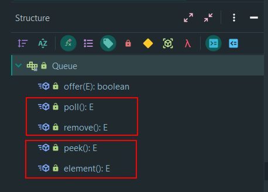
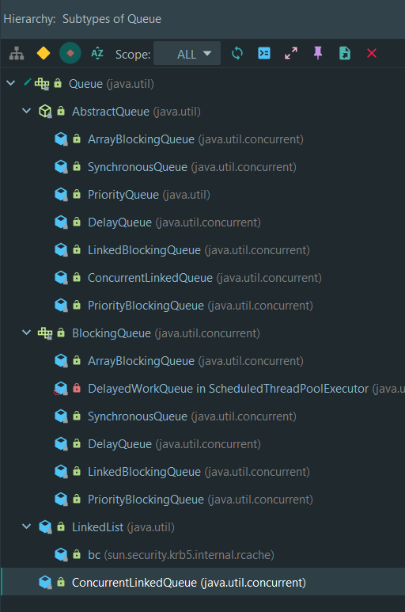
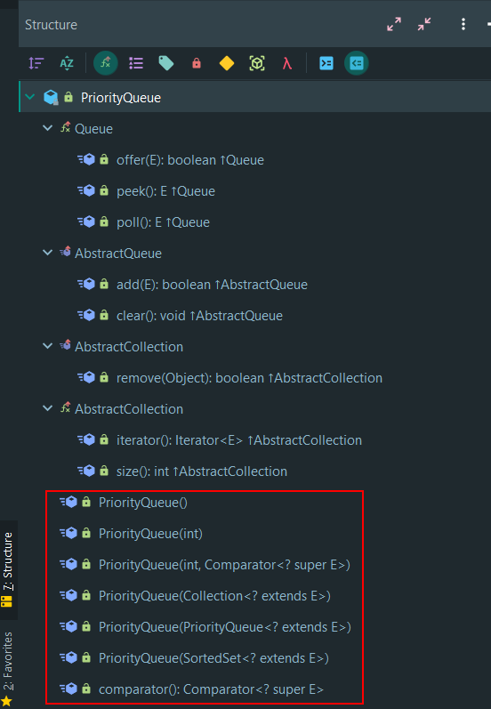

# Queue与PriorityQueue的jdk1.5.0源码分析

## 前言

为什么会选择jdk1.5.0来做分析？因为Queue和PriorityQueue都是jdk1.5的时候出来的。体会一个类，一个功能的最快捷，最能理解其设计思想的方法，就是去看它推出来的第一版。因为，那个时候的代码是最为精简，也最为容易体会它的设计思想。所以，我选了jdk1.5.0来看。


## 1 Queue

Queue在代码形式上，是一个接口。

### 1.1 Queue的API



#### jdk1.5.0时候的Queue

jdk1.5.0的时候，Queue接口代码上，只有5个如图所示的方法。

- poll跟remove是一对的，功能一样，但remove取不出元素会抛异常，poll是返回null。

- peek跟element是一对的，功能一样，但element查不到队列头元素会抛异常，peek是返回null。


#### jdk1.6.0时候的Queue

jdk1.6.0的时候，Queue接口代码上又新增了add方法，跟offer凑成了一对。

- offer跟add是一对的，功能一样，但add插入不了元素会抛异常，offer是返回false。

> ```
> * When using a capacity-restricted queue, this method is generally
> * preferable to {@link #add}, which can fail to insert an element only
> * by throwing an exception.
> ```
>
> 如果是使用有界队列（大小有限制），jdk建议使用offer


**注意：Queue不允许插入为null的元素！！！ 否则，poll，peek这两个方法，取不到，查不到元素返回null，逻辑上就说不过去了!**


> 直到现在的java 13，Queue接口代码上依然是这6个方法。


### 1.2 Queue的继承层次与实现

#### jdk1.5.0，Queue接口的继承层次与实现




## 2 PriorityQueue


### 2.1 PriorityQueue概述

```
 * An unbounded priority {@linkplain Queue queue} based on a priority
 * heap.
```

jdk的注释文档，开篇一句话，就给PriorityQueue定性了。

PriorityQueue是一个无界的(注意，是无界的) 优先级队列，而且它是基于堆的。


### 2.2 PriorityQueue的API




PriorityQueue除了它作为一个Queue队列和Collection集合所必须向外界提供的职责外。它自己所独有的API，基本是没有，也就**基本只有各种它自己的构造器**以及一个获取它的内部比较器comparator的方法。


### 2.3 PriorityQueue的存储结构与逻辑结构


```java
    /**
     * Priority queue represented as a balanced binary heap: the two children
     * of queue[n] are queue[2*n] and queue[2*n + 1].  The priority queue is
     * ordered by comparator, or by the elements' natural ordering, if
     * comparator is null:  For each node n in the heap and each descendant d
     * of n, n <= d.
     *
     * The element with the lowest value is in queue[1], assuming the queue is
     * nonempty.  (A one-based array is used in preference to the traditional
     * zero-based array to simplify parent and child calculations.)
     *
     * queue.length must be >= 2, even if size == 0.
     */
    private transient Object[] queue;
```


虽然，PriorityQueue是一个无界队列，但是，**它的底层存储结构是一个数组**。会有动态扩容的动作，所以，对外，体现为一个无界队列。


> Priority queue represented as a balanced binary heap.

**它的内部逻辑结构是一个平衡二叉堆**。


### 2.4 PriorityQueue元素优先级比较方式

PriorityQueue元素优先级的比较方式有两种：

- 在构造器传入一个Comparator的实现，Comparator的实现类做比较逻辑
- 不使用Comparator，而是由PriorityQueue的每个元素去实现Comparable接口


```java
private void fixUp(int k) {
    if (comparator == null) {
        while (k > 1) {
            int j = k >> 1;
            if (((Comparable<E>)queue[j]).compareTo((E)queue[k]) <= 0)
                break;
            Object tmp = queue[j];  queue[j] = queue[k]; queue[k] = tmp;
            k = j;
        }
    } else {
        while (k > 1) {
            int j = k >>> 1;
            if (comparator.compare((E)queue[j], (E)queue[k]) <= 0)
                break;
            Object tmp = queue[j];  queue[j] = queue[k]; queue[k] = tmp;
            k = j;
        }
    }
```

随便挑选一段代码，都可以发现，PriorityQueue优先采用的是传入一个comparator的实现。如果没有比较器Comparator，才回去看元素的自身实现。


### 2.5 PriorityQueue的API分析


#### 2.5.1 构造方法PriorityQueue(Collection<? extends E> c)

```java
public PriorityQueue(Collection<? extends E> c) {
    initializeArray(c);
    if (c instanceof SortedSet) {
        SortedSet<? extends E> s = (SortedSet<? extends E>)c;
        comparator = (Comparator<? super E>)s.comparator();
        fillFromSorted(s);
    } else if (c instanceof PriorityQueue) {
        PriorityQueue<? extends E> s = (PriorityQueue<? extends E>) c;
        comparator = (Comparator<? super E>)s.comparator();
        fillFromSorted(s);
    } else {
        comparator = null;
        fillFromUnsorted(c);//未排序的执行这里
    }
}
```


```java
    /**
     * Establishes the heap invariant (described above) in the entire tree,
     * assuming nothing about the order of the elements prior to the call.
     */
    private void heapify() {
        for (int i = size/2; i >= 1; i--)
            fixDown(i);
    }
```


之所以选PriorityQueue(Collection c)来解说，更符合一般情况。可以看到，如果传入的集合是无序的话，会执行fillFromUnsorted(c)。而fillFromUnsorted(c)会调用heapify()。**而heapify就是建堆！**

而heapify里面调用的fixDown(i)就是 让位置i原本的元素在最大堆中"下降",以使得位置i存的元素始终都是优先级最高的，以及以i为根的子树都是"最大堆"。

> 如果看过《算法导论》堆排序，它的建最大堆的算法就是**BUILD-MAX-HEAP，对应这里的heapify**。
>
> **它的MAX-HEAPIFY算法，让i号原本的元素在堆中下降，使得一个i为根的，对应这里的fixDown**。


#### 2.5.2 offer

```java
public boolean offer(E o) {
    if (o == null)
        throw new NullPointerException();
    modCount++;
    ++size;

    // Grow backing store if necessary
    if (size >= queue.length) 
        grow(size);

    queue[size] = o;
    fixUp(size);
    return true;
}
```


##### offer分析

- grow(size); 数组长度不够，扩容，没什么好说了。

  > newlen <<= 2; 但扩容的话，源码可以看到，容量按位左移2位，就是4倍。也就是每次容量不够，都扩为原来的4倍。

- queue[size] = o;

  > 将要插入的元素放到最末尾，也就是树的最底层，最后一个元素。那么也就是除了它，其它的元素以及他们的位置，都组成了一个最大堆。而包括插入的元素，就不一定了。所以才有后面的fixUp

- fixUp(size);

  > fixUp要做得事情就是，如果size位置的元素比它的父节点要大，那么就把它交换上去。如果还比父节点大，继续交换上去。知道最后满足堆的条件。

截一小段fixUp的代码看一下就可以看到这个逻辑。

```java
while (k > 1) {
    int j = k >>> 1;
    if (comparator.compare((E)queue[j], (E)queue[k]) <= 0)
        break;
    Object tmp = queue[j];  queue[j] = queue[k]; queue[k] = tmp;
    k = j;
}
```


整棵树高度是lg n层，所以fixUp最多是把要插入的元素元素推lg n层。所以fixUp的时间复杂度是O(lg n)。

**offer的时间复杂度是O(lg n)**


#### 2.5.3 poll

```java
    public E poll() {
        if (size == 0)
            return null;
        modCount++;

        E result = (E) queue[1];
        queue[1] = queue[size];
        queue[size--] = null;  // Drop extra ref to prevent memory leak
        if (size > 1)
            fixDown(1);

        return result;
    }
```


##### poll分析

- E result = (E) queue[1]; queue[1]是堆顶元素，优先级最高的。取出来作为结果

- queue[1] = queue[size]; 

  >  queue[size]是最末尾的元素，也就是优先级最低的元素。把它取出来放到原本的堆顶位置。这个时候，堆顶的左右子树的"堆性质"是没有任何变化的。但是，现在queue[1]位置放的是优先级最小的。那整棵树来讲，是不满足最大堆的。所以，才会有后面的fixDown

- queue[size--] = null;  // Drop extra ref to prevent memory leak

  > 将queue末尾元素置为null，以便后面它指向的对象，已经没有其它有效的引用，本因被GC。但是因为它的引用，却无法GC。从而导致memory leak

- fixDown(1);

  > 这个就是queue[1]位置的元素，做下降操作，然后从而使的整棵树能再次堆化。这个操作的时间复杂度是O(lg n)


**所以，poll的时间复杂度是O(lg n)**


#### 2.5.4 peek

```java
public E peek() {
    if (size == 0)
        return null;
    return (E) queue[1];
}
```

##### peek分析

数组的1号元素就是堆顶，就是优先级最高的元素，所以直接返回queue[1]即可。

**peek 时间复杂度是O(1)**


------


上述，是我对jdk1.5.0中Queue和PriorityQueue的源码分析。但是，之后，后面的jdk，特别是1.8，有没有对它做了一些数据结构或者算法上的改变呢？我赶着交作业，真的没空去细看了。后面找时间再看看，总结吧。