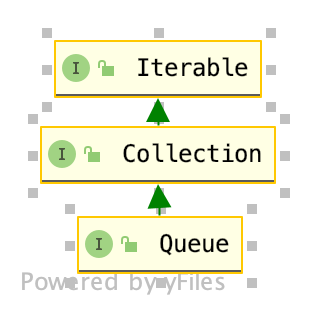
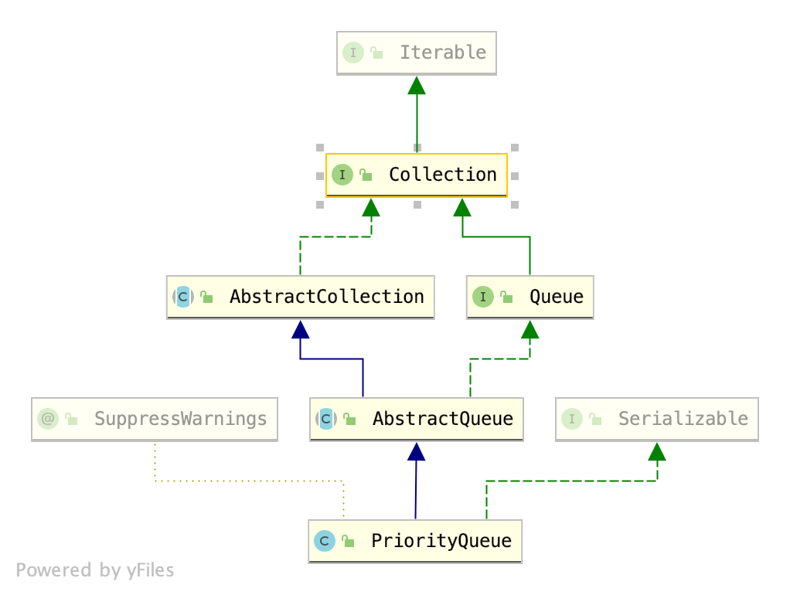
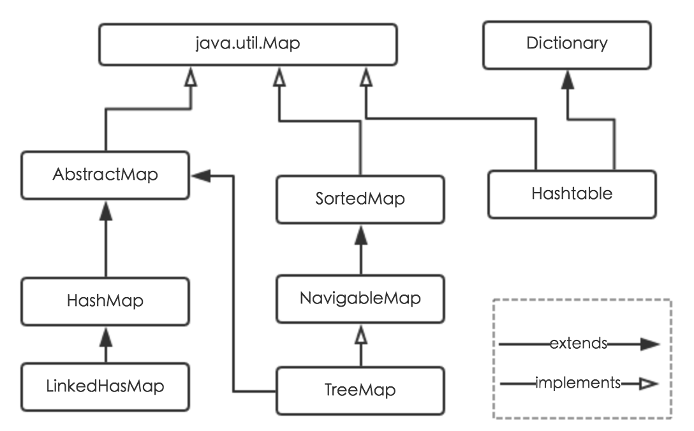
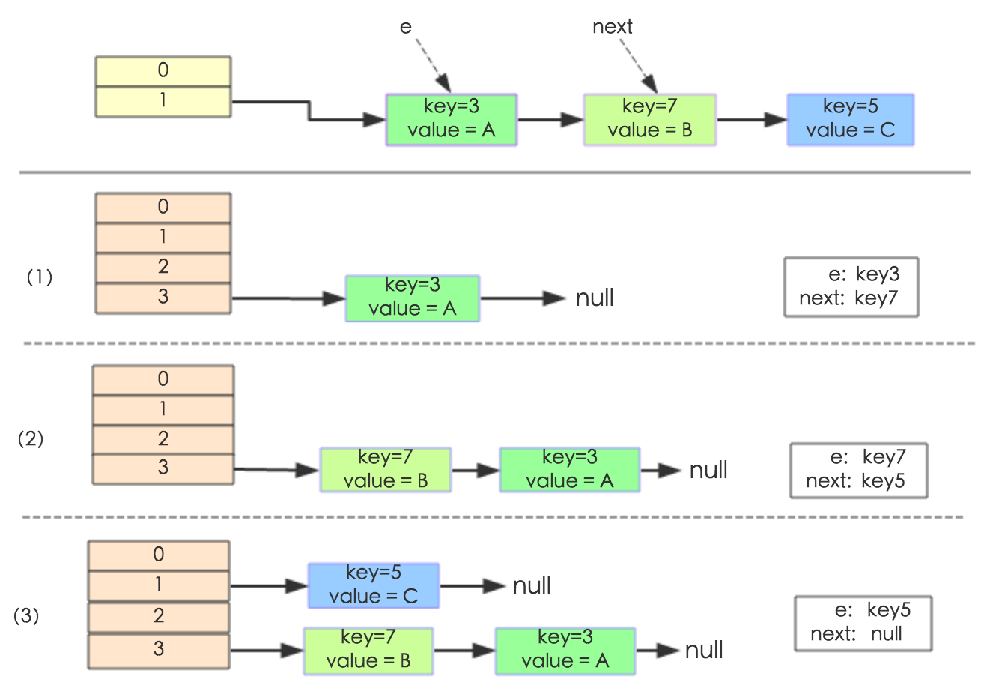
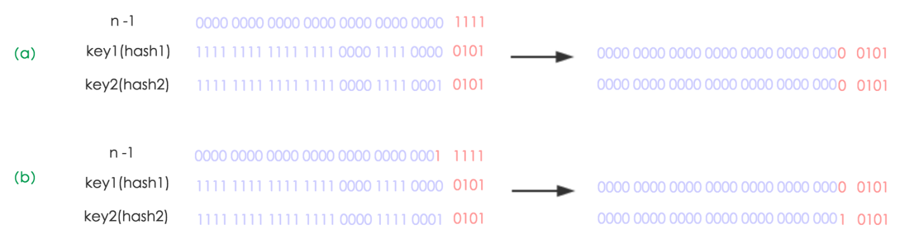
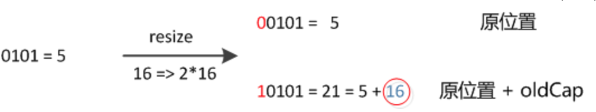
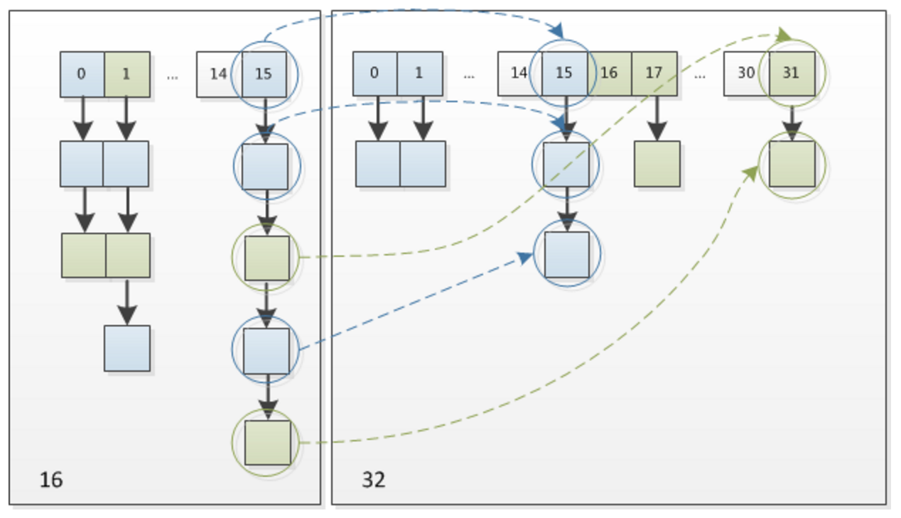

# week02学习笔记
## 使用addFirst和addlast改写代码
原代码

```
Deque<String> deque = new LinkedList<>();

deque.push("a");
deque.push("b");
deque.push("c");
System.out.println(deque);

String str = deque.peek();
System.out.println(str);
System.out.println(deque);

while ((deque.size() > 0)){
    System.out.println(deque.pop());
}
System.out.println(deque);
```
改写后

```
Deque<String> deque = new LinkedList<>();
deque.addLast("b");
deque.addLast("a");
deque.addFirst("c");
System.out.println(deque);

String str = deque.peekFirst();
System.out.println(str);
System.out.println(deque);

while(deque.size() > 0){
    System.out.println(deque.pollFirst());
}
System.out.println(deque);
```
## Queue和Priority Queue的源码分析
### Queue源码分析- jdk11
#### 基本信息
所在模块:`java.base`
所在包: `java.util`
定义: `Interface Queue<E>`
参数类型`<E>`
实现的父接口`Collection<E>, Iterable<E>`
子接口`BlockingDeque<E>, BlockingQueue<E>, Deque<E>, TransferQueue<E>`
子类`AbstractQueue, ArrayBlockingQueue, ArrayDeque, ConcurrentLinkedDeque, ConcurrentLinkedQueue, DelayQueue, LinkedBlockingDeque, LinkedBlockingQueue, LinkedList, LinkedTransferQueue, PriorityBlockingQueue, PriorityQueue, SynchronousQueue`



Queue接口主要方法

|         | Throws exception	Returns | special value |
| ------- | --------------------------- | ------------- |
| Insert  | add(e)                      | offer(e)      |
| Remove  | remove()                    | poll()        |
| Examine | element()                   | peek()        |

### Priority Queue源码分析- jdk11
#### 基本信息
所在模块:`java.base`
所在包: `java.util`
定义: `Class PriorityQueue<E>`
参数类型`<E>`
实现的父接口`Serializable, Iterable<E>, Collection<E>, Queue<E>`
子类：暂无




#### 类说明
无界的优先级队列基于优先级堆来实现，队列中元素根据元素的自然顺序或在构造队列时传入的比较器来决定。优先级队列中不允许空元素，依赖自然排序的优先级队列不允许插入不能比较的元素(可能导致`ClassCastException`)。
就指定的顺序而言，此队列的头是最小的元素。如果多个元素的价值最小，那么头就是那些元素之一绑定规则被任意打破。队列检索操作poll, remove, peek,element元素，该访问元素位于队列的开头。

优先级队列是无界的，但是具有内部容量来控制用于在队列上存储元素的数组的大小。它总是至少与队列大小一样大。将元素添加到优先级队列时，其容量会自动增长。未指定增长政策的详细信息。

此类及其迭代器实现`Collection`和`Iterator`接口的所有可选方法。方法`iterator()`中提供的`Iterator`和方法`spliterator()`中提供的`Spliterator`不能保证以任何特定顺序遍历优先级队列的元素。如果需要有序遍历，请考虑使用`Arrays.sort(pq.toArray())`。

请注意，此实现未同步。如果任何线程修改了队列，则多个线程不应同时访问`PriorityQueue`实例。而是使用线程安全的`PriorityBlockingQueue`类。

实施注意事项：此实现为入队和出队方法（`offer`, `poll`,`remove()`,`add`）提供O(log(n))时间； `remove(Object)`和`contains(Object)`方法的O(n)线性时间；和O(1)固定时间的检索方法(`peek, element, size`)。

此类是Java Collections Framework的成员。
#### 源码分析

##### 成员变量
```
    private static final long serialVersionUID = -7720805057305804111L;
    // 默认容量
    private static final int DEFAULT_INITIAL_CAPACITY = 11;

    /**
      * 优先队列的数据存储在平衡二叉堆中：
      queue[n]的左右子节点分别是queue[2*n+1]和queue[2*(n+1)]。       优先级队列由比较器comperator或元素的自然顺序（如果比较器comperator为null），对于堆和每个n的后代，n <= d。 如果队列不为空，则最小值为queue[0]。
     */
    transient Object[] queue; // non-private to simplify nested class access

    /**
     * The number of elements in the priority queue.
     */
    int size;

    /**
     * The comparator, or null if priority queue uses elements'
     * natural ordering.
     */
    private final Comparator<? super E> comparator;

    /**
     * The number of times this priority queue has been
     * <i>structurally modified</i>.  See AbstractList for gory details.
     */
    transient int modCount;     // non-private to simplify nested class access
```
##### 构造函数
PriorityQueue 构造函数大致分为三类：第一种前两个，使用自然顺序对元素进行比较，可以指定初始容量或使用默认初始容量11；第二类是指定比较器comparator，可以指定初始容量和使用默认；第三种是使用别的容器对象来实例化。

| 构造器                                                       | 描述                                                         |
| ------------------------------------------------------------ | ------------------------------------------------------------ |
| `PriorityQueue()`                                            | 创建一个具有默认初始容量（11）的`PriorityQueue`，该默认容量根据其自然顺序对其元素进行排序。 |
| `PriorityQueue(int initialCapacity)`                         | 创建具有指定初始容量的`PriorityQueue`，该容量根据其自然顺序对其元素进行排序。 |
| `PriorityQueue(int initialCapacity, Comparator<? super E> comparator)` | 创建具有指定初始容量的PriorityQueue，该容量根据指定的比较器对其元素进行排序。 |
| `PriorityQueue(Comparator<? super E> comparator)`            | 创建一个具有默认初始容量并且其元素根据指定的比较器排序的PriorityQueue。 |
| `PriorityQueue(Collection<? extends E> c)`                   | 创建一个包含指定集合中元素的`PriorityQueue`。                |
| `PriorityQueue(PriorityQueue<? extends E> c) `               | 创建一个包含指定优先级队列中的元素的`PriorityQueue`。        |
| `PriorityQueue(SortedSet<? extends E> c)`                    | 创建一个包含指定排序集中的元素的`PriorityQueue`              |

##### 方法实现
add/offer方法
```
    public boolean add(E e) {
        return offer(e);
    }

    /**
     * Inserts the specified element into this priority queue.
     *
     * @return {@code true} (as specified by {@link Queue#offer})
     * @throws ClassCastException if the specified element cannot be
     *         compared with elements currently in this priority queue
     *         according to the priority queue's ordering
     * @throws NullPointerException if the specified element is null
     */
    public boolean offer(E e) {
        if (e == null)
            throw new NullPointerException();
        modCount++;
        int i = size;
        if (i >= queue.length)
            grow(i + 1);
        siftUp(i, e);
        size = i + 1;
        return true;
    }
```
add方法由offer实现，offer方法先-判断是否需要扩容，如果需要，扩容为i+1最终调用siftUp，会根据是使用织染顺序比较还是比较器来调用不同的方法对元素进行插入。插入时，第一个位置总为es[size]，如果该节点比父节点大，则将父节点挪到es[size],该元素继续与父节点的父节点比较

```
    private static <T> void siftUpUsingComparator(
        int k, T x, Object[] es, Comparator<? super T> cmp) {
        while (k > 0) {
            int parent = (k - 1) >>> 1;
            Object e = es[parent];
            if (cmp.compare(x, (T) e) >= 0)
                break;
            es[k] = e;
            k = parent;
        }
        es[k] = x;
    }
```
remove

```
    public boolean remove(Object o) {
        int i = indexOf(o);
        if (i == -1)
            return false;
        else {
            removeAt(i);
            return true;
        }
    }
```
remove通过removeAt(int i)实现

```
E removeAt(int i) {
    // assert i >= 0 && i < size;
    final Object[] es = queue;
    modCount++;
    int s = --size;
    if (s == i) // removed last element
        es[i] = null;
    else {
        E moved = (E) es[s];
        es[s] = null;
        siftDown(i, moved);
        if (es[i] == moved) {
            siftUp(i, moved);
            if (es[i] != moved)
                return moved;
        }
    }
    return null;
}
```
最后通过siftDown实现，与siftUp相反

```
private static <T> void siftDownComparable(int k, T x, Object[] es, int n) {
    // assert n > 0;
    Comparable<? super T> key = (Comparable<? super T>)x;
    int half = n >>> 1;           // loop while a non-leaf
    while (k < half) {
        int child = (k << 1) + 1; // assume left child is least
        Object c = es[child];
        int right = child + 1;
        if (right < n &&
            ((Comparable<? super T>) c).compareTo((T) es[right]) > 0)//取左右子节点中小的那个
            c = es[child = right];
        //若待插入节点比该位置k的左右子节点都小，则该位置K就是插入的位置，否则循环继续往该子节点的左右子节点查找可以插入的位置
        if (key.compareTo((T) c) <= 0)
            break;
        es[k] = c;
        k = child;
    }
    es[k] = key;
}
```
`boolean contains(Object o)`函数通过`indexOf(Object o)`实现,没啥好说的，从前到后一个个比较；

```
private int indexOf(Object o) {
    if (o != null) {
        final Object[] es = queue;
        for (int i = 0, n = size; i < n; i++)
            if (o.equals(es[i]))
                return i;
    }
    return -1;
}
```
##### 总结
###### 时间复杂度
插入节点时间复杂度为 O(logN)
删除节点时间复杂度为 O(logN)
查看是否存在某一个元素时间复杂度为O(N)

## HashMap的小总结- jdk11
### 类总体介绍

#### 实现类介绍
1. HashMap：它根据键的hashCode值存储数据，大多数情况下可以直接定位到它的值，因而具有很快的访问速度，但遍历顺序却是不确定的。 HashMap最多只允许一条记录的键为null，允许多条记录的值为null。HashMap非线程安全，即任一时刻可以有多个线程同时写HashMap，可能会导致数据的不一致。如果需要满足线程安全，可以用 Collections的synchronizedMap方法使HashMap具有线程安全的能力，或者使用ConcurrentHashMap。
2. Hashtable：Hashtable是遗留类，很多映射的常用功能与HashMap类似，不同的是它承自Dictionary类，并且是线程安全的，任一时间只有一个线程能写Hashtable，并发性不如ConcurrentHashMap，因为ConcurrentHashMap引入了分段锁。Hashtable不建议在新代码中使用，不需要线程安全的场合可以用HashMap替换，需要线程安全的场合可以用ConcurrentHashMap替换。
3. LinkedHashMap：LinkedHashMap是HashMap的一个子类，保存了记录的插入顺序，在用Iterator遍历LinkedHashMap时，先得到的记录肯定是先插入的，也可以在构造时带参数，按照访问次序排序。
4. TreeMap：TreeMap实现SortedMap接口，能够把它保存的记录根据键排序，默认是按键值的升序排序，也可以指定排序的比较器，当用Iterator遍历TreeMap时，得到的记录是排过序的。如果使用排序的映射，建议使用TreeMap。在使用TreeMap时，key必须实现Comparable接口或者在构造TreeMap传入自定义的Comparator，否则会在运行时抛出java.lang.ClassCastException类型的异常。
对于上述四种Map类型的类，要求映射中的key是不可变对象。不可变对象是该对象在创建后它的哈希值不会被改变。如果对象的哈希值发生变化，Map对象很可能就定位不到映射的位置了。

#### HashMap类介绍

通过上面的比较，我们知道了HashMap是Java的Map家族中一个普通成员，鉴于它可以满足大多数场景的使用条件，所以是使用频度最高的一个。下文我们主要结合源码，从存储结构、常用方法分析、扩容以及安全性等方面深入讲解HashMap的工作原理。
基于哈希表的Map接口的实现。此实现提供所有可选的映射操作，并允许空值和空键。 (`HashMap`类与`Hashtable`大致等效，不同之处在于它是不同步的，并且允许为null)此类不保证映射的顺序。特别是，它不能保证顺序会随着时间的推移保持恒定。
假设哈希函数将元素正确分散在存储桶中，则此实现为基本操作（获取和放置）提供恒定时间的性能。集合视图上的迭代所需的时间与HashMap实例的“容量”（存储桶数）及其大小（键-值映射数）成正比。因此，如果迭代性能很重要，则不要将初始容量设置得过高（或负载因子过低），这一点非常重要。

HashMap的实例具有两个影响其性能的参数：初始容量和负载因子。容量是哈希表中存储桶的数量，初始容量只是创建哈希表时的容量。负载因子是在自动增加其哈希表容量之前允许哈希表获得的满度的度量。当哈希表中的条目数超过负载因子和当前容量的乘积时，哈希表将被重新哈希（即，内部数据结构将被重建），因此哈希表的存储桶数大约为两倍。

通常，默认负载因子(0.75)在时间和空间成本之间提供了一个很好的权衡。较高的值会减少空间开销，但会增加查找成本（在HashMap类的大多数操作中都得到体现，包括get和put）。设置其初始容量时，应考虑映射中的预期条目数及其负载因子，以最大程度地减少重新哈希操作的数量。如果初始容量大于最大条目数除以负载因子，则不会发生任何哈希操作。

如果将许多映射存储在HashMap实例中，则创建具有足够大容量的映射将比让其根据需要增长表的自动重新哈希处理更有效地存储映射。请注意，使用具有相同hashCode()的许多键是降低任何哈希表性能的肯定方法。为了改善影响，当键是Comparable时，此类可以使用键之间的比较顺序来帮助打破关系。

请注意，此实现未同步。如果多个线程同时访问哈希映射，并且至少有一个线程在结构上修改该映射，则必须在外部进行同步。 (结构修改是添加或删除一个或多个映射的任何操作；仅更改与实例已经包含的键相关联的值不是结构修改。)通常通过在自然封装了Map的某个对象上进行同步来实现。 。如果不存在这样的对象，则应使用`Collections.synchronizedMap`方法“包装”`Map`。最好在创建时完成此操作，以防止意外不同步地访问Map：

  ` Map m = Collections.synchronizedMap(new HashMap(...))`;
此类的所有“集合视图方法”返回的迭代器都是快速失败的：如果在创建迭代器后的任何时间对结构进行结构修改，则除了通过迭代器自己的remove方法之外，该迭代器都将抛出`ConcurrentModificationException` 。因此，面对并发修改，迭代器会快速干净地失败，而不会在未来的不确定时间内冒任意，不确定的行为的风险。

注意，迭代器的快速失败行为无法得到保证，因为通常来说，在存在不同步的并发修改的情况下，不可能做出任何严格的保证。快速失败的迭代器会尽最大努力抛出`ConcurrentModificationException`。因此，编写依赖于此异常的程序的正确性是错误的：迭代器的快速失败行为仅应用于检测错误。

此类是Java Collections Framework的成员。

#### 参数类型:
K - the type of keys maintained by this map
V - the type of mapped values
#### 所有实现的接口:
Serializable, Cloneable, Map<K,V>
#### 直接已知子类:
LinkedHashMap, PrinterStateReason

### 构造函数

| Constructor                                    | Description                                                  |
| ---------------------------------------------- | ------------------------------------------------------------ |
| HashMap()                                      | 构造一个初始容量为16负载因子为0.75的空HashMap                |
| HashMap(int initialCapacity)                   | 构造一个初始容量为initialCapacity负载因子为0.75的空HashMap   |
| HashMap(int initialCapacity, float loadFactor) | 构造一个初始容量为initialCapacity负载因子为loadFactor的空HashMap |
| HashMap(Map<? extends K,? extends V> m)        | 构造一个与m映射关系一样的HashMap                             |

### 成员变量 

```
//初始容量为16
static final int DEFAULT_INITIAL_CAPACITY = 1 << 4; // aka 16

//最大容量table长度
static final int MAXIMUM_CAPACITY = 1 << 30;

//默认负载因子，根据泊松分布得来
static final float DEFAULT_LOAD_FACTOR = 0.75f;

//每个table桶中存放的数据转换条件，大于8且node总数大于64进行转，由链表转换为红黑树
static final int TREEIFY_THRESHOLD = 8;

//每个table桶中存放的数据转换条件，小于6进行转，由红黑树转换为链表
static final int UNTREEIFY_THRESHOLD = 6;

/**
 * The smallest table capacity for which bins may be treeified.
 * (Otherwise the table is resized if too many nodes in a bin.)
 * Should be at least 4 * TREEIFY_THRESHOLD to avoid conflicts
 * between resizing and treeification thresholds.
 */
static final int MIN_TREEIFY_CAPACITY = 64;
    
transient Node<K,V>[] table;

// 持有key-value的集合，可以通过EntrySet来获取key和value
transient Set<Map.Entry<K,V>> entrySet;

//键值对总数
transient int size;

/**防止并发修改时存储该HashMap目前的修改次数，当目前modCount和之前状态的不同时,说明有其他线程也在修改该HashMap的结构，会抛出ConcurrentModificationException
*/
transient int modCount;

//下一个该扩容的值(capacity * load factor)
int threshold;

//一般不需要修改，使用默认的0.75即可，超过size > capacity * loadFactor 之后需要扩容
final float loadFactor;
```

### 方法

#### hash方法

HashMap的内部功能实现很多，本文主要从根据key获取哈希桶数组索引位置、put方法的详细执行、扩容过程三个具有代表性的点深入展开讲解。

1. 确定哈希桶数组索引位置

不管增加、删除、查找键值对，定位到哈希桶数组的位置都是很关键的第一步。前面说过HashMap的数据结构是数组和链表的结合，所以我们当然希望这个HashMap里面的元素位置尽量分布均匀些，尽量使得每个位置上的元素数量只有一个，那么当我们用hash算法求得这个位置的时候，马上就可以知道对应位置的元素就是我们要的，不用遍历链表，大大优化了查询的效率。HashMap定位数组索引位置，直接决定了hash方法的离散性能。先看看源码的实现(方法一+方法二):

方法一：

```
static final int hash(Object key) {   //jdk1.8 & jdk1.7
     int h;
     // h = key.hashCode() 为第一步 取hashCode值
     // h ^ (h >>> 16)  为第二步 高位参与运算
     return (key == null) ? 0 : (h = key.hashCode()) ^ (h >>> 16);
}
```
方法二：

```
 //jdk1.7的源码，jdk1.8没有这个方法，但是实现原理一样的
static int indexFor(int h, int length) { 
     return h & (length-1);  //第三步 取模运算
}
```
这里的Hash算法本质上就是三步：取key的hashCode值、高位运算、取模运算。

对于任意给定的对象，只要它的hashCode()返回值相同，那么程序调用方法一所计算得到的Hash码值总是相同的。我们首先想到的就是把hash值对数组长度取模运算，这样一来，元素的分布相对来说是比较均匀的。但是，模运算的消耗还是比较大的，在HashMap中是这样做的：调用方法二来计算该对象应该保存在table数组的哪个索引处。

这个方法非常巧妙，它通过h & (table.length -1)来得到该对象的保存位，而HashMap底层数组的长度总是2的n次方，这是HashMap在速度上的优化。当length总是2的n次方时，h& (length-1)运算等价于对length取模，也就是h%length，但是&比%具有更高的效率。

在JDK1.8的实现中，优化了高位运算的算法，通过hashCode()的高16位异或低16位实现的：(h = k.hashCode()) ^ (h >>> 16)，主要是从速度、功效、质量来考虑的，这么做可以在数组table的length比较小的时候，也能保证考虑到高低Bit都参与到Hash的计算中，同时不会有太大的开销。

#### put源码
```

final V putVal(int hash, K key, V value, boolean onlyIfAbsent,
               boolean evict) {
    Node<K,V>[] tab; Node<K,V> p; int n, i;
    if ((tab = table) == null || (n = tab.length) == 0)
//1、判断当table为null或者tab的长度为0时，即table尚未初始化，此时通过resize()方法得到初始化的table
        n = (tab = resize()).length;
    if ((p = tab[i = (n - 1) & hash]) == null)
//1.1、此处通过（n - 1） & hash 计算出的值作为tab的下标i，并另p表示tab[i]，也就是该链表第一个节点的位置。并判断p是否为null
        tab[i] = newNode(hash, key, value, null);
//1.1.1、当p为null时，表明tab[i]上没有任何元素，那么接下来就new第一个Node节点，调用newNode方法返回新节点赋值给tab[i]
    else {
//2.1下面进入p不为null的情况，有三种情况：p为链表节点；p为红黑树节点；p是链表节点但长度为临界长度TREEIFY_THRESHOLD，再插入任何元素就要变成红黑树了。
        Node<K,V> e; K k;
        if (p.hash == hash &&
            ((k = p.key) == key || (key != null && key.equals(k))))
//2.1.1HashMap中判断key相同的条件是key的hash相同，并且符合equals方法。这里判断了p.key是否和插入的key相等，如果相等，则将p的引用赋给e

            e = p;
        else if (p instanceof TreeNode)
//2.1.2现在开始了第一种情况，p是红黑树节点，那么肯定插入后仍然是红黑树节点，所以我们直接强制转型p后调用TreeNode.putTreeVal方法，返回的引用赋给e
            e = ((TreeNode<K,V>)p).putTreeVal(this, tab, hash, key, value);
        else {
//2.1.3接下里就是p为链表节点的情形，也就是上述说的另外两类情况：插入后还是链表/插入后转红黑树。另外，上行转型代码也说明了TreeNode是Node的一个子类
            for (int binCount = 0; ; ++binCount) {
//我们需要一个计数器来计算当前链表的元素个数，并遍历链表，binCount就是这个计数器

                if ((e = p.next) == null) {
                    p.next = newNode(hash, key, value, null);
                    if (binCount >= TREEIFY_THRESHOLD - 1) 
// 插入成功后，要判断是否需要转换为红黑树，因为插入后链表长度加1，而binCount并不包含新节点，所以判断时要将临界阈值减1
                        treeifyBin(tab, hash);
//当新长度满足转换条件时，调用treeifyBin方法，将该链表转换为红黑树
                    break;
                }
                if (e.hash == hash &&
                    ((k = e.key) == key || (key != null && key.equals(k))))
                    break;
                p = e;
            }
        }
        if (e != null) { // existing mapping for key
            V oldValue = e.value;
            if (!onlyIfAbsent || oldValue == null)
                e.value = value;
            afterNodeAccess(e);
            return oldValue;
        }
    }
    ++modCount;
    if (++size > threshold)
        resize();
    afterNodeInsertion(evict);
    return null;
}

```
注意在 `treeifyBin(tab, hash)`函数中对是否进行转换做了判断，要小于`MIN_TREEIFY_CAPACITY`

```
final void treeifyBin(Node<K,V>[] tab, int hash) {
    int n, index; Node<K,V> e;
    // 在这里会判断存放头结点桶的长度是否达到了最小的转换限制MIN_TREEIFY_CAPACITY
    if (tab == null || (n = tab.length) < MIN_TREEIFY_CAPACITY)
        resize();
    else if ((e = tab[index = (n - 1) & hash]) != null) {
        TreeNode<K,V> hd = null, tl = null;
        do {
            TreeNode<K,V> p = replacementTreeNode(e, null);
            if (tl == null)
                hd = p;
            else {
                p.prev = tl;
                tl.next = p;
            }
            tl = p;
        } while ((e = e.next) != null);
        if ((tab[index] = hd) != null)
            hd.treeify(tab);
    }
}
```

remove元素源码

```
final Node<K,V> removeNode(int hash, Object key, Object value,
                           boolean matchValue, boolean movable) {
    Node<K,V>[] tab; 
    //当存放节点的桶为链表时，待删除节点的前驱节点，当待删除节点为tab[index]时p==node
    Node<K,V> p; 
    //table, capacity也就是table的容量，index为key所在槽的索引
    int n, index;
    if ((tab = table) != null && (n = tab.length) > 0 &&
        (p = tab[index = (n - 1) & hash]) != null) {
        //node为待删除节点，
        Node<K,V> node = null, e; K k; V v;
        if (p.hash == hash &&
            ((k = p.key) == key || (key != null && key.equals(k))))
            node = p;
        else if ((e = p.next) != null) {
            if (p instanceof TreeNode)
                node = ((TreeNode<K,V>)p).getTreeNode(hash, key);
            else {
                do {
                    if (e.hash == hash &&
                        ((k = e.key) == key ||
                         (key != null && key.equals(k)))) {
                        node = e;
                        break;
                    }
                    p = e;
                } while ((e = e.next) != null);
            }
        }
        //找到待删除的节点后开始删除，如果节点为treeNode实例，调用TreeNode.removeTreeNode方法删除,若为链表节点，则判断是否是头结点，对应进行删除，如果是，将后继节点设为头结点
        if (node != null && (!matchValue || (v = node.value) == value ||
                             (value != null && value.equals(v)))) {
            if (node instanceof TreeNode)
                ((TreeNode<K,V>)node).removeTreeNode(this, tab, movable);
            else if (node == p)
                tab[index] = node.next;
            else
                p.next = node.next;
            ++modCount;
            --size;
            afterNodeRemoval(node);
            return node;
        }
    }
    return null;
}

```

#### hashMap是如何扩容的？
##### jdk1.7
扩容(resize)就是重新计算容量，向HashMap对象里不停的添加元素，而HashMap对象内部的数组无法装载更多的元素时，对象就需要扩大数组的长度，以便能装入更多的元素。当然Java里的数组是无法自动扩容的，方法是使用一个新的数组代替已有的容量小的数组，就像我们用一个小桶装水，如果想装更多的水，就得换大水桶。

```
void resize(int newCapacity) {   //传入新的容量
     Entry[] oldTable = table;    //引用扩容前的Entry数组
     int oldCapacity = oldTable.length;         
     if (oldCapacity == MAXIMUM_CAPACITY) {  //扩容前的数组大小如果已经达到最大(2^30)了
         threshold = Integer.MAX_VALUE; //修改阈值为int的最大值(2^31-1)，这样以后就不会扩容了
         return;
     }
  
     Entry[] newTable = new Entry[newCapacity];  //初始化一个新的Entry数组
     transfer(newTable);                         //！！将数据转移到新的Entry数组里
     table = newTable;                           //HashMap的table属性引用新的Entry数组
     threshold = (int)(newCapacity * loadFactor);//修改阈值
}
```
这里就是使用一个容量更大的数组来代替已有的容量小的数组，transfer()方法将原有Entry数组的元素拷贝到新的Entry数组里。


```
void transfer(Entry[] newTable) {
    Entry[] src = table;                   //src引用了旧的Entry数组
    int newCapacity = newTable.length;
    for (int j = 0; j < src.length; j++) { //遍历旧的Entry数组
        Entry<K,V> e = src[j];             //取得旧Entry数组的每个元素
        if (e != null) {
            src[j] = null;//释放旧Entry数组的对象引用（for循环后，旧的Entry数组不再引用任何对象）
             do {
                 Entry<K,V> next = e.next;
                 int i = indexFor(e.hash, newCapacity); //！！重新计算每个元素在数组中的位置
                 e.next = newTable[i]; //标记[1]
                 newTable[i] = e;      //将元素放在数组上
                 e = next;             //访问下一个Entry链上的元素
             } while (e != null);
        }
    }
}
```
newTable[i]的引用赋给了e.next，也就是使用了单链表的头插入方式，同一位置上新元素总会被放在链表的头部位置；这样先放在一个索引上的元素终会被放到Entry链的尾部(如果发生了hash冲突的话），这一点和Jdk1.8有区别，下文详解。在旧数组中同一条Entry链上的元素，通过重新计算索引位置后，有可能被放到了新数组的不同位置上。

下面举个例子说明下扩容过程。假设了我们的hash算法就是简单的用key mod 一下表的大小（也就是数组的长度）。其中的哈希桶数组table的size=2， 所以key = 3、7、5，put顺序依次为 5、7、3。在mod 2以后都冲突在table[1]这里了。这里假设负载因子 loadFactor=1，即当键值对的实际大小size 大于 table的实际大小时进行扩容。接下来的三个步骤是哈希桶数组 resize成4，然后所有的Node重新rehash的过程。



##### jdk1.8
我们分析下resize的源码，鉴于JDK1.8融入了红黑树，较复杂，为了便于理解我们仍然使用JDK1.7的代码，好理解一些，本质上区别不大，具体区别后文再说。
JDK1.8做了哪些优化。经过观测可以发现，我们使用的是2次幂的扩展(指长度扩为原来2倍)，所以，元素的位置要么是在原位置，要么是在原位置再移动2次幂的位置。看下图可以明白这句话的意思，n为table的长度，图（a）表示扩容前的key1和key2两种key确定索引位置的示例，图（b）表示扩容后key1和key2两种key确定索引位置的示例，其中hash1是key1对应的哈希与高位运算结果。



元素在重新计算hash之后，因为n变为2倍，那么n-1的mask范围在高位多1bit(红色)，因此新的index就会发生这样的变化：



因此，我们在扩充HashMap的时候，不需要像JDK1.7的实现那样重新计算hash，只需要看看原来的hash值新增的那个bit是1还是0就好了，是0的话索引没变，是1的话索引变成“原索引+oldCap”，可以看看下图为16扩充为32的resize示意图：


这个设计确实非常的巧妙，既省去了重新计算hash值的时间，而且同时，由于新增的1bit是0还是1可以认为是随机的，因此resize的过程，均匀的把之前的冲突的节点分散到新的bucket了。这一块就是JDK1.8新增的优化点。有一点注意区别，JDK1.7中rehash的时候，旧链表迁移新链表的时候，如果在新表的数组索引位置相同，则链表元素会倒置，但是从上图可以看出，JDK1.8不会倒置。有兴趣的同学可以研究下JDK1.8的resize源码，写的很赞，如下:


```
final Node<K,V>[] resize() {
    Node<K,V>[] oldTab = table;
    int oldCap = (oldTab == null) ? 0 : oldTab.length;
    int oldThr = threshold;
    int newCap, newThr = 0;
    if (oldCap > 0) {
        // 超过最大值就不再扩充了，就只好随你碰撞去吧
        if (oldCap >= MAXIMUM_CAPACITY) {
            threshold = Integer.MAX_VALUE;
            return oldTab;
        }
        // 没超过最大值，就扩充为原来的2倍
        else if ((newCap = oldCap << 1) < MAXIMUM_CAPACITY &&
                 oldCap >= DEFAULT_INITIAL_CAPACITY)
            newThr = oldThr << 1; // double threshold
    }
    else if (oldThr > 0) // initial capacity was placed in threshold
        newCap = oldThr;
    else {               // zero initial threshold signifies using defaults
        newCap = DEFAULT_INITIAL_CAPACITY;
        newThr = (int)(DEFAULT_LOAD_FACTOR * DEFAULT_INITIAL_CAPACITY);
    }
    // 计算新的resize上限
    if (newThr == 0) {
        float ft = (float)newCap * loadFactor;
        newThr = (newCap < MAXIMUM_CAPACITY && ft < (float)MAXIMUM_CAPACITY ?
                  (int)ft : Integer.MAX_VALUE);
    }
    threshold = newThr;
    @SuppressWarnings({"rawtypes"，"unchecked"})
        Node<K,V>[] newTab = (Node<K,V>[])new Node[newCap];
    table = newTab;
    if (oldTab != null) {
        // 把每个bucket都移动到新的buckets中
        for (int j = 0; j < oldCap; ++j) {
            Node<K,V> e;
            if ((e = oldTab[j]) != null) {
                oldTab[j] = null;
                if (e.next == null)
                    newTab[e.hash & (newCap - 1)] = e;
                else if (e instanceof TreeNode)
                    ((TreeNode<K,V>)e).split(this, newTab, j, oldCap);
                else { // 链表优化重hash的代码块
                    Node<K,V> loHead = null, loTail = null;
                    Node<K,V> hiHead = null, hiTail = null;
                    Node<K,V> next;
                    do {
                        next = e.next;
                        // 原索引
                        if ((e.hash & oldCap) == 0) {
                            if (loTail == null)
                                loHead = e;
                            else
                                loTail.next = e;
                            loTail = e;
                        }
                        // 原索引+oldCap
                        else {
                            if (hiTail == null)
                                hiHead = e;
                            else
                                hiTail.next = e;
                            hiTail = e;
                        }
                    } while ((e = next) != null);
                    // 原索引放到bucket里
                    if (loTail != null) {
                        loTail.next = null;
                        newTab[j] = loHead;
                    }
                    // 原索引+oldCap放到bucket里
                    if (hiTail != null) {
                        hiTail.next = null;
                        newTab[j + oldCap] = hiHead;
                    }
                }
            }
        }
    }
    return newTab;
}

```
### hashMap是如何实现遍历的
当我们调用hashMap的entrySet(),会根据情况创建一个EntrySet<K,V>

```
/**
 * Returns a {@link Set} view of the mappings contained in this map.
 * The set is backed by the map, so changes to the map are
 * reflected in the set, and vice-versa.  If the map is modified
 * while an iteration over the set is in progress (except through
 * the iterator's own {@code remove} operation, or through the
 * {@code setValue} operation on a map entry returned by the
 * iterator) the results of the iteration are undefined.  The set
 * supports element removal, which removes the corresponding
 * mapping from the map, via the {@code Iterator.remove},
 * {@code Set.remove}, {@code removeAll}, {@code retainAll} and
 * {@code clear} operations.  It does not support the
 * {@code add} or {@code addAll} operations.
 *
 * @return a set view of the mappings contained in this map
 */
public Set<Map.Entry<K,V>> entrySet() {
    Set<Map.Entry<K,V>> es;
    return (es = entrySet) == null ? (entrySet = new EntrySet()) : es;
}
```
我们看看这个EntrySet，

```
final class EntrySet extends AbstractSet<Map.Entry<K,V>> {
        public final int size()                 { return size; }
    public final void clear()               { HashMap.this.clear(); }
    public final Iterator<Map.Entry<K,V>> iterator() {
        return new EntryIterator();
    }
    public final boolean contains(Object o) {
        if (!(o instanceof Map.Entry))
            return false;
        Map.Entry<?,?> e = (Map.Entry<?,?>) o;
        Object key = e.getKey();
        Node<K,V> candidate = getNode(hash(key), key);
        return candidate != null && candidate.equals(e);
    }
    public final boolean remove(Object o) {
        if (o instanceof Map.Entry) {
            Map.Entry<?,?> e = (Map.Entry<?,?>) o;
            Object key = e.getKey();
            Object value = e.getValue();
            return removeNode(hash(key), key, value, true, true) != null;
        }
        return false;
    }
    public final Spliterator<Map.Entry<K,V>> spliterator() {
        return new EntrySpliterator<>(HashMap.this, 0, -1, 0, 0);
    }
    public final void forEach(Consumer<? super Map.Entry<K,V>> action) {
        Node<K,V>[] tab;
        if (action == null)
            throw new NullPointerException();
        if (size > 0 && (tab = table) != null) {
            int mc = modCount;
            for (Node<K,V> e : tab) {
                for (; e != null; e = e.next)
                    action.accept(e);
            }
            if (modCount != mc)
                throw new ConcurrentModificationException();
        }
    }
}
```
它的`iterator()`方法返回了一个`new EntryIterator()`;

```
    final class EntryIterator extends HashIterator
        implements Iterator<Map.Entry<K,V>> {
        public final Map.Entry<K,V> next() { return nextNode(); }
    }
```
这个EntryIterator重写了next()方法，使得我们可以从table的每一个存在数据的节点遍历完这个桶之后，接下来遍历下一个存在数据的桶，

```
abstract class HashIterator {
    Node<K,V> next;        // next entry to return
    Node<K,V> current;     // current entry
    int expectedModCount;  // for fast-fail
    int index;             // current slot

    HashIterator() {
        expectedModCount = modCount;
        Node<K,V>[] t = table;
        current = next = null;
        index = 0;
        if (t != null && size > 0) { // advance to first entry
            do {} while (index < t.length && (next = t[index++]) == null);
        }
    }

    public final boolean hasNext() {
        return next != null;
    }

    final Node<K,V> nextNode() {
        Node<K,V>[] t;
        Node<K,V> e = next;
        if (modCount != expectedModCount)
            throw new ConcurrentModificationException();
        if (e == null)
            throw new NoSuchElementException();
        if ((next = (current = e).next) == null && (t = table) != null) {
            do {} while (index < t.length && (next = t[index++]) == null);
        }
        return e;
    }

    public final void remove() {
        Node<K,V> p = current;
        if (p == null)
            throw new IllegalStateException();
        if (modCount != expectedModCount)
            throw new ConcurrentModificationException();
        current = null;
        removeNode(p.hash, p.key, null, false, false);
        expectedModCount = modCount;
    }
}
```
同理KeySet和ValueSet也是一样，重写了next方法，三个Set本质上是获取node节点，从node节点中取不同的数据罢了

``` 
final class KeyIterator extends HashIterator
    implements Iterator<K> {
    public final K next() { return nextNode().key; }
}

final class ValueIterator extends HashIterator
    implements Iterator<V> {
    public final V next() { return nextNode().value; }
}

```
### TODO红黑树的学习

```
//TODO
hashMap的红黑树是如何退化成链表的，又是如何treefi的
//TODO

```

### 参考资料：
1. https://zhuanlan.zhihu.com/p/21673805
2. https://docs.oracle.com/en/java/javase/11/docs/api/java.base/java/util/HashMap.html